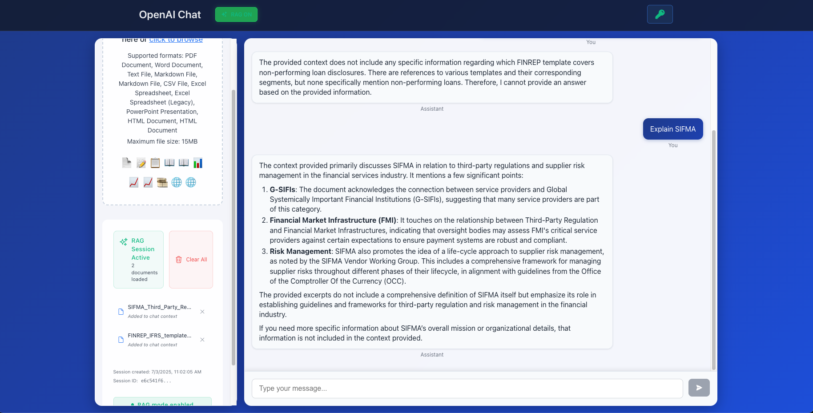

# OpenAI Chat Application with RAG Integration

A sophisticated chat application leveraging OpenAI's language models with advanced Retrieval-Augmented Generation (RAG) capabilities for document-based conversational AI.

---



---

## Overview

This application provides an intelligent document processing and chat interface that combines traditional conversational AI with context-aware document analysis. Users can upload various document formats and engage in informed conversations based on document content through our RAG implementation.

## Key Features

### Core Functionality
- **OpenAI Integration**: Powered by OpenAI's latest language models
- **RAG Implementation**: Advanced retrieval-augmented generation for document-based conversations
- **Multi-Format Support**: Comprehensive document processing capabilities
- **Session Management**: Persistent conversation sessions with context retention
- **Dual Mode Operation**: Toggle between standard chat and document-enhanced RAG mode

### Supported Document Formats
- **PDF Documents**: Standard PDF file processing
- **Microsoft Office**: Word documents (.docx), Excel spreadsheets (.xlsx, .xls), PowerPoint presentations (.pptx)
- **Text Formats**: Plain text (.txt), Markdown (.md, .markdown)
- **Data Files**: CSV files with structured data processing
- **Web Documents**: HTML files (.html, .htm)

### Technical Capabilities
- **Batch Processing**: Optimized document processing with concurrent batch operations
- **Performance Optimization**: Enhanced processing speed with configurable memory allocation
- **Error Handling**: Comprehensive error management and user feedback
- **File Validation**: Robust file type and size validation (15MB limit)
- **Progress Tracking**: Real-time processing status updates

## Technology Stack

### Frontend
- **Framework**: React 18 with TypeScript
- **Build Tool**: Vite for optimized development and production builds
- **Styling**: CSS modules with responsive design principles
- **HTTP Client**: Axios for API communication

### Backend
- **Framework**: FastAPI with Python 3.9+
- **AI Integration**: OpenAI Python SDK
- **Document Processing**: Multiple specialized libraries for different formats
- **Vector Database**: Integrated vector storage for RAG functionality
- **Dependency Management**: pip with requirements.txt

### Deployment
- **Platform**: Vercel with serverless functions
- **Configuration**: Production-optimized settings with 60-second timeout and 2GB memory allocation
- **Environment Management**: Secure environment variable handling

## Installation and Setup

### Prerequisites
- Python 3.9 or higher
- Node.js 16 or higher
- OpenAI API key
- Git for version control

### Local Development Environment

1. **Repository Setup**
   ```bash
   git clone https://github.com/yourusername/openai-chat-app.git
   cd openai-chat-app
   ```

2. **Backend Configuration**
   ```bash
   python -m venv .venv
   source .venv/bin/activate  # Windows: .venv\Scripts\activate
   pip install -r api/requirements.txt
   ```

3. **Frontend Setup**
   ```bash
   cd frontend
   npm install
   ```

4. **Environment Configuration**
   Create `.env` file in the `api` directory:
   ```
   OPENAI_API_KEY=your_openai_api_key_here
   ```

5. **Application Startup**
   
   Backend server (Terminal 1):
   ```bash
   cd api
   python app.py
   ```
   
   Frontend development server (Terminal 2):
   ```bash
   cd frontend
   npm run dev
   ```

6. **Access Application**
   - Frontend: http://localhost:3000
   - Backend API: http://localhost:8000

## Production Deployment

### Vercel Deployment Process

1. **Vercel CLI Installation**
   ```bash
   npm install -g vercel
   ```

2. **Authentication**
   ```bash
   vercel login
   ```

3. **Deployment Execution**
   ```bash
   vercel --prod
   ```

4. **Environment Configuration**
   Configure the following environment variables in Vercel dashboard:
   - `OPENAI_API_KEY`: Your OpenAI API key
   - `PYTHONPATH`: Set to `.`

### Production Configuration

The application includes production-optimized settings:
- **Timeout**: 60-second function timeout for large document processing
- **Memory**: 2GB memory allocation for optimal performance
- **Concurrency**: Controlled batch processing with maximum 3 concurrent operations
- **File Limits**: 15MB maximum file size for document uploads

## Usage Guidelines

### Document Upload Process
1. Access the application interface
2. Select or drag files to the upload area
3. Wait for processing completion confirmation
4. Enable RAG mode for document-based conversations
5. Begin contextual chat interactions

### RAG Mode Operation
- **Standard Mode**: Traditional OpenAI chat functionality
- **RAG Mode**: Document-enhanced conversations with context retrieval
- **Mode Toggle**: Switch between modes as needed during conversations

### Session Management
- Sessions automatically persist conversation history
- Document uploads are associated with current session
- Clear sessions to start fresh conversations

## API Documentation

### Core Endpoints
- `POST /api/chat`: Handle chat interactions
- `POST /api/upload`: Process document uploads
- `GET /api/health`: Application health check
- `POST /api/sessions`: Session management
- `GET /api/documents`: Document listing and management

### Request/Response Format
All API endpoints follow RESTful conventions with JSON request/response bodies and appropriate HTTP status codes.

## Development Guidelines

### Code Structure
- **Frontend Components**: Modular React components with TypeScript
- **Backend Services**: FastAPI routers with service layer separation
- **Shared Types**: Consistent type definitions across frontend and backend
- **Configuration**: Environment-based configuration management

### Best Practices
- Follow TypeScript strict mode guidelines
- Implement comprehensive error handling
- Use consistent code formatting with provided configurations
- Write descriptive commit messages
- Test functionality before submitting changes

## Troubleshooting

### Common Issues

**API Authentication Errors**
```
Resolution: Verify OpenAI API key configuration in environment variables
```

**Document Upload Failures**
```
Resolution: Check file size (max 15MB) and supported format compatibility
```

**RAG Mode Malfunctions**
```
Resolution: Ensure document processing completed successfully and RAG mode is enabled
```

**Performance Issues**
```
Resolution: Monitor file sizes and consider batch processing for large documents
```

### Support Resources
- Check application logs for detailed error messages
- Verify environment variable configuration
- Ensure all dependencies are properly installed
- Confirm network connectivity for API calls

## Contributing

### Development Workflow
1. Fork the repository
2. Create a feature branch: `git checkout -b feature/enhancement-name`
3. Implement changes with appropriate tests
4. Commit with descriptive messages: `git commit -m 'Add feature description'`
5. Push to feature branch: `git push origin feature/enhancement-name`
6. Submit pull request with detailed description

### Code Standards
- Follow existing code style and conventions
- Include appropriate documentation for new features
- Test functionality across different browsers and devices
- Ensure responsive design principles are maintained

## License

This project is licensed under the MIT License. See the LICENSE file for complete terms and conditions.

## Acknowledgments

- OpenAI for providing advanced language model capabilities
- The open-source community for foundational libraries and tools
- Contributors who have enhanced the application functionality

---

**Current Version**: Multi-file support with enhanced performance optimization  
**Last Updated**: July 2025  
**Deployment Status**: Production-ready with Vercel hosting
